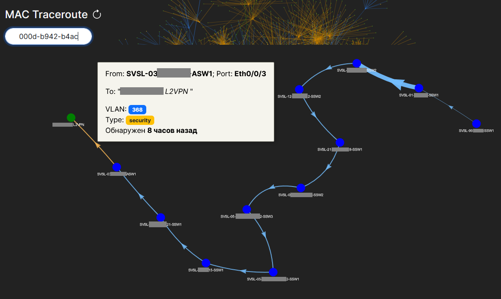

# Ecstasy


[](https://skillicons.dev)

[](https://skillicons.dev)

## Веб-приложение для взаимодействия с сетевым оборудованием

Позволяет отображать информацию о сетевых устройствах в удобном для чтения формате
без ввода консольных команд.


### Структура


Web-console позволит подключаться к оборудованию через терминал в браузере

Чтобы запустить и настроить web-console нужно [следовать инструкции](web-console/README.md).

### Возможности:

- Взаимодействие с сетевым оборудованием
    - Отображение интерфейсов оборудования в реальном времени
    - Сбор конфигурации
    - Создание шаблонов команд ([wiki](https://github.com/ig-rudenko/ecstasy/wiki/Шаблоны-команд))
    - Управление состоянием порта (up/down)
    - Просмотр MAC адресов на порту
    - Просмотр текущей конфигурации порта
    - Перенаправление для просмотра логов в Elastic Stack
    - Просмотр ошибок на порту
    - Возможность просматривать и сбрасывать текущую сессию по MAC адресу
    - Сохранение файлов конфигураций оборудования

Кроме того, Ecstasy предоставляет дополнительные функции для визуализации
и поиска сетевой информации:

- Отображение топологии VLAN / MAC
- Поиск по текстовому описанию интерфейсов
- Поиск IP/MAC адреса
- Создание и просмотр интерактивных карт
- Учёт загруженности оборудования
- База GPON подключений и пользователей

### Поддержка производителей оборудования:

Список поддерживаемых вендоров приведен ниже. Другие модели тоже могут быть совместимы, но я имею доступ только к этим
устройствам.

- `Cisco`
    - Проверено для: `WS-C4500*` `WS-C35*0` `WS-C3750*` `ME-3*00X` `ME-4924` `ME-3400`
- `Eltex`
    - Проверено для: `MES3324*` `ESR-12VF` `LTP-4X(8X)-rev.*` `LTP-16N`
- `MikroTik`
    - Проверено для: `RouterOS v6.* (v7.*)`
- `Huawei`
    - Проверено для: `S2403TP` `S2326TP` `CX600-X8` `CE6865`
- `Huawei DSL (GPON)`
    - Проверено для: `MA5600T`
- `Iskratel DSL`
    - Проверено для: `MPC8560`
- `D-Link`
    - Проверено для: `DES-3200-*` `DES-3028` `DES-3526` `DGS-3420` `DGS-12**`
- `Extreme`
    - Проверено для: `X460-*` `X670-*`
- `ZTE`
    - Проверено для: `ZXR10 2928E` `2936-FI` `2952E`
- `Q-Tech`
    - Проверено для: `QSW-3450-*` `QSW-8200-*`

## Запуск

### Docker

Рекомендуемым и простым способом является запуск через docker compose.

Для начала скопируйте файл `.env.example` в `.env` и укажите свои данные в нём.

```shell
cp .env.example .env
```

Теперь запустите контейнеры.

```shell
docker compose build;
docker compose up -d;
```

По умолчанию создастся пользователь: `admin/password1`.

---

### Удобный поиск оборудования


### Просмотр загруженности интерфейсов оборудований


При выборе оборудования показывается его информация:

- Состояние оборудования
- Нагрузка CPU, RAM, Flash и температура
- Подробная информация (берется из Zabbix)
- Ссылка в Zabbix
- Ссылка на карту с местоположением оборудования
- Логи в Elastic Search
- Перечень конфигураций
- Медиафайлы
- Интерфейсы


При выборе конкретного порта открывается его информация:
Описание, конфигурация, счетчик ошибок, диагностика состояния кабеля, список MAC адресов.


Для станционных терминалов GPON OLT возможен следующий вывод информации об интерфейсе (указан ниже).


## Карты

Реализована возможность отображать и создавать интерактивные карты:

- Из ссылки на внешнюю карту;
- Из HTML файла карты;
- Из совокупности различных слоев. Слой может быть представлен:
    - Из группы в Zabbix (будут отображаться узлы сети, которые имеют координаты);
    - Из файла формата GEOJSON.

Интерактивные карты со слоями из Zabbix группы отображают доступность оборудования
с описанием проблемы в Zabbix.


## Топология VLAN

Построение топологии VLAN по оборудованию.


## Топология прохождения MAC адреса

Определение маршрута MAC адреса между оборудованиями.



## Поиск по описанию порта


### Технические данные GPON подключений


## Кастомные команды

### import_from_zabbix

    # python manage.py import_from_zabbix

    Импорт узлов сети из zabbix
    
    options:
      -h, --help            show this help message and exit
      -g GROUPS, --groups GROUPS
                            Имена Zabbix групп через запятую
      -a AUTH, --auth AUTH  Имя группы авторизации для узла сети
      -s, --save            Сохранить в базу узлы сети
      --change-group CHANGE_GROUP
                            Имя группы Ecstasy, которая будет использоваться для всех узлов сети. Если не указана, то будет использована оригинальная группа Zabbix
      --all-status          Импортируем также узлы сети, которые деактивированы в Zabbix
      --interface-scan {telnet,ssh,snmp}
                            Протокол для сбора интерфейсов узла сети. (по умолчанию ssh)
      --snmp-community SNMP_COMMUNITY
                            SNMP Community (необязательно)
      --cli-protocol {telnet,ssh}
                            Протокол для выполнения команд узла сети. (по умолчанию ssh)
      --name-pattern NAME_PATTERN
                            Паттерн для имени узлов сети. Если совпадает, то будет импортирован. (необязательно)
      --ip-pattern IP_PATTERN
                            Паттерн для IP узла сети. Если совпадает, то будет импортирован. (необязательно)
      --server SERVER       URL сервера Zabbix (необязательно)
      --user USER           Имя пользователя Zabbix (необязательно)
      --password PASSWORD   Пароль пользователя Zabbix (необязательно)
      --debug               Выводить дополнительную информацию
      --version             Show program's version number and exit.
      -v {0,1,2,3}, --verbosity {0,1,2,3}
                            Verbosity level; 0=minimal output, 1=normal output, 2=verbose output, 3=very verbose output
      --settings SETTINGS   The Python path to a settings module, e.g. "myproject.settings.main". If this isn't provided, the DJANGO_SETTINGS_MODULE environment variable will be used.
      --pythonpath PYTHONPATH
                            A directory to add to the Python path, e.g. "/home/djangoprojects/myproject".
      --traceback           Raise on CommandError exceptions.
      --no-color            Don't colorize the command output.
      --force-color         Force colorization of the command output.
      --skip-checks         Skip system checks.

> [!NOTE]
> По умолчанию используются данные авторизации Zabbix хранимые в базе.
> Указывается через панель администратора: `App settings -> Zabbix API settings`
> Чтобы не сохранять в базу данных, а только протестировать какие узлы будут учитываться
> нужно выполнять команды без параметра `--save`.

### Примеры:

Импорт активных узлов сети из Zabbix группы `devs` в новую группу `devs` ecstasy,
с указанием группы авторизации `creds-1`, а также использование `telnet`
как способа подключения к оборудованию:

```shell
python manage.py import_from_zabbix --save -g devs -a creds-1 --interface-scan=telnet --cli-protocol=telnet
```

---

Импорт активных узлов сети из диапазона `172.30.0.0/24` Zabbix группы `devs` в новую группу `devs` ecstasy,
с указанием группы авторизации `creds-1`, а также использование `ssh` (По умолчанию SSH)
как способа подключения к оборудованию:

```shell
python manage.py import_from_zabbix --save -g devs -a creds-1 --ip-pattern='172\.30\.0\.\d+'
```

## Создание связей моделей

```shell
python manage.py graph_models -a --rankdir LR --dot -g -o ./docs/models.dot
dot -Tsvg ./docs/models.dot -o ./docs/models.svg
```
