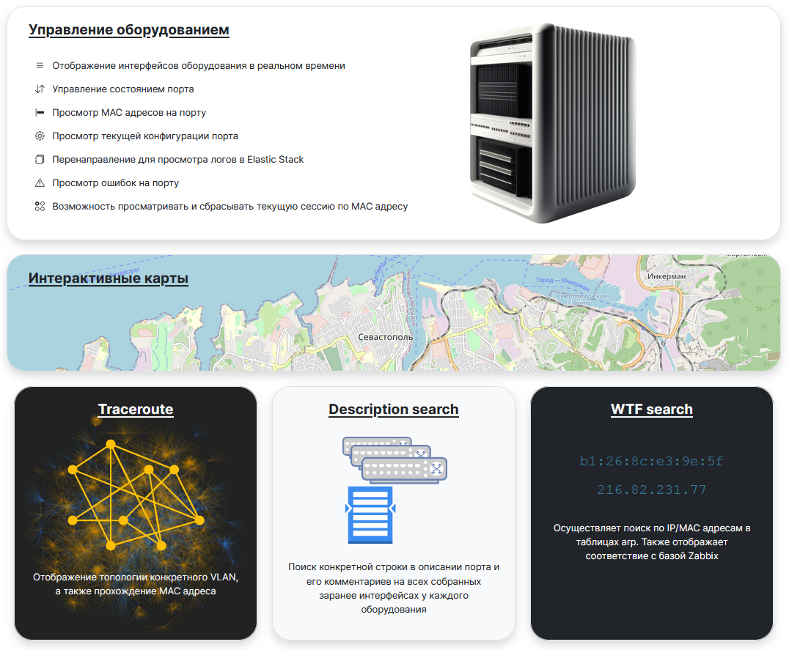
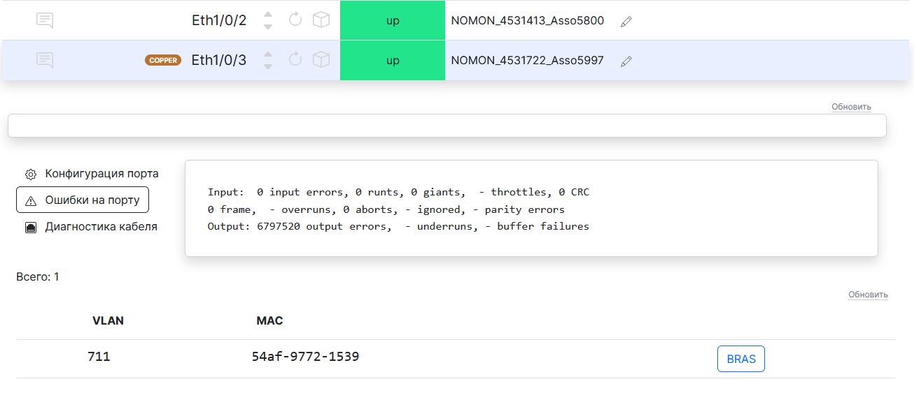
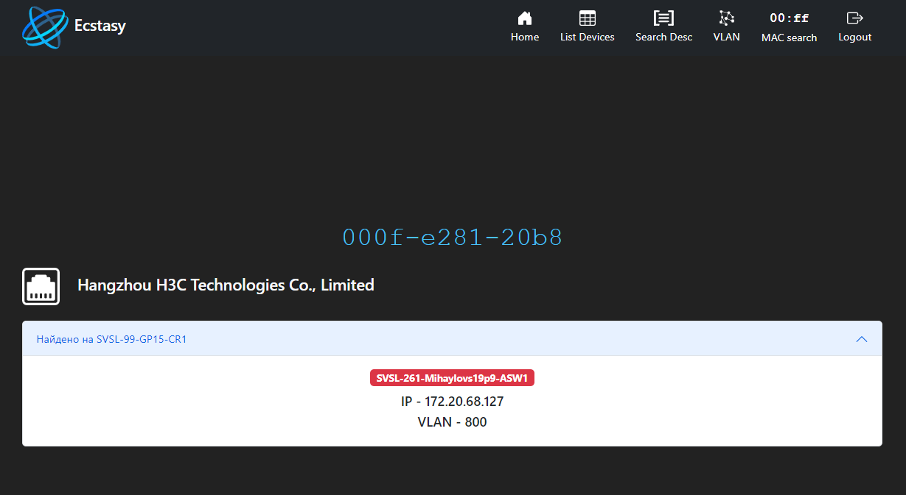

# Ecstasy

### Веб-приложение для взаимодействия с сетевым оборудованием

Позволяет отображать информацию о сетевых устройствах в удобном для чтения формате
без ввода консольных команд.

### Возможности:

- Отображение интерфейсов оборудования в реальном времени

- Управление состоянием порта (up/down)

- Просмотр MAC адресов на порту

- Просмотр текущей конфигурации порта

- Перенаправление для просмотра логов в Elastic Stack

- Просмотр ошибок на порту

- Возможность просматривать и сбрасывать текущую сессию по MAC адресу

### Поддержка производителей:

В данный момент поддерживаются следующие вендоры:
- Cisco
- Eltex
- Huawei
- Huawei DSL
- Huawei GPON
- Iskratel DSL
- D-Link
- Extreme
- ZTE
- Q-Tech
- Edge-Core

### Удобный поиск оборудования

При выборе устройства открывается окно с его интерфейсами

Подробная информация берется из Zabbix через API, добавляется в конфигурационный файл

Если в Zabbix указаны координаты, то добавляется возможность посмотреть на карте

При определении MAC адресов на порту добавляется также другая полезная информация о нём

На изображении ниже представлен вывод состояния DSL порта, где также указываются
основные параметры линии помимо MAC адреса

Для другого оборудования возможен следующий вывод информации об интерфейсе (указан ниже)

Определяется тип порта (SFP или copper), можно посмотреть конфигурацию порта

## Дополнительные утилиты

### Найти порт по его описанию

### Посмотреть как проходит VLAN по сети

### Найти по MAC адресу оборудование

