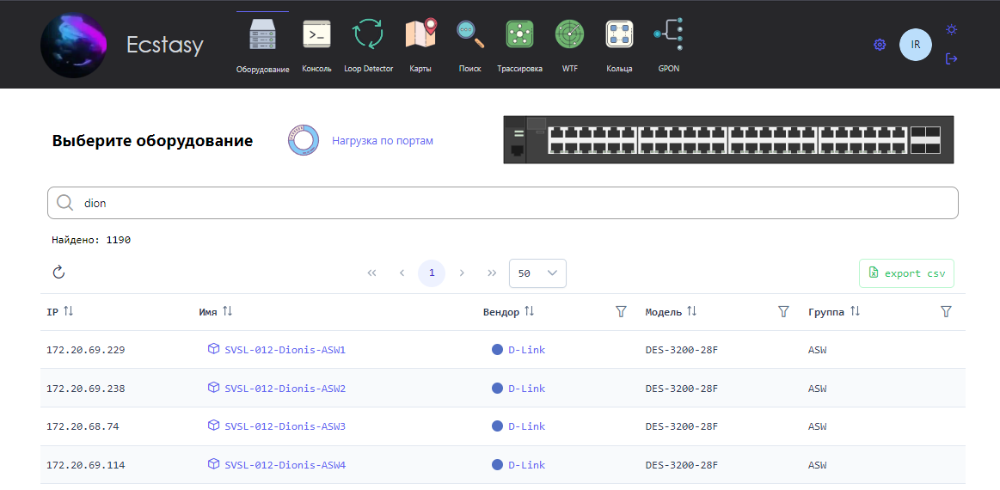
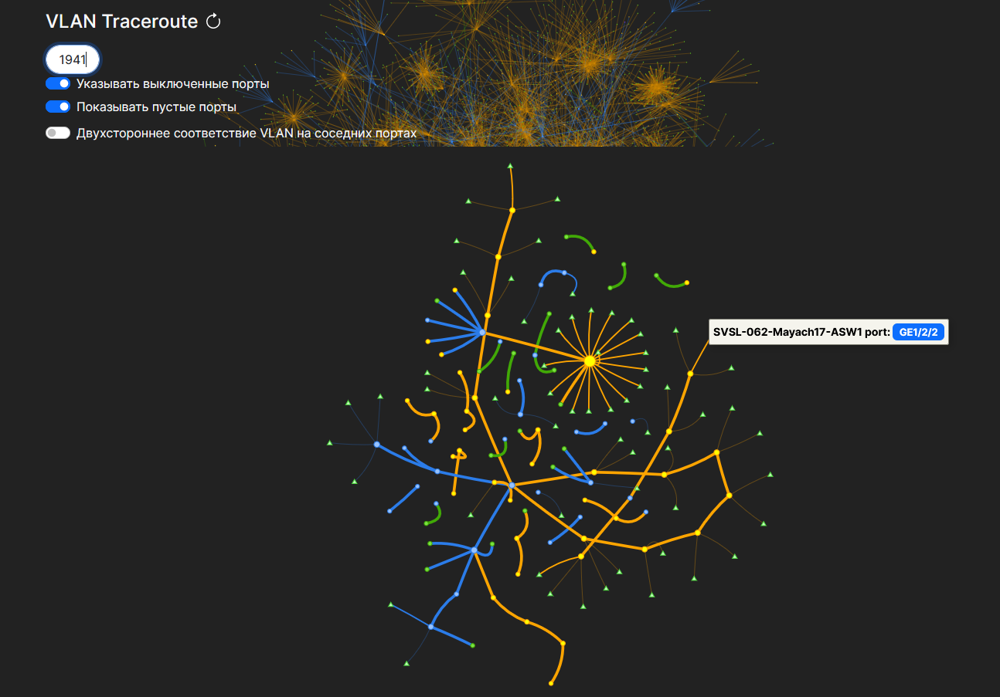

# Ecstasy

<strong style="padding: 2px; vertical-align: text-bottom">+</strong>

<strong style="padding: 2px; vertical-align: text-bottom">+</strong>

<strong style="padding: 2px; vertical-align: text-bottom">+</strong>

### Веб-приложение для взаимодействия с сетевым оборудованием

Позволяет отображать информацию о сетевых устройствах в удобном для чтения формате
без ввода консольных команд.

### Возможности:

- Взаимодействие с сетевым оборудованием
  - Отображение интерфейсов оборудования в реальном времени
  - Управление состоянием порта (up/down)
  - Просмотр MAC адресов на порту
  - Просмотр текущей конфигурации порта
  - Перенаправление для просмотра логов в Elastic Stack
  - Просмотр ошибок на порту
  - Возможность просматривать и сбрасывать текущую сессию по MAC адресу
  - Сохранение файлов конфигураций оборудования

Кроме того, Ecstasy предоставляет дополнительные функции для визуализации 
и поиска сетевой информации:

- Отображение топологии VLAN / MAC
- Поиск по текстовому описанию интерфейсов
- Поиск IP/MAC адреса
- Создание и просмотр интерактивных карт

### Поддержка производителей оборудования:

Список поддерживаемых вендоров приведен ниже. Другие модели тоже могут быть совместимы, но я имею доступ только к этим устройствам.
- `Cisco`
  - Проверено для: `WS-C4500*` `WS-C35*0` `WS-C3750*` `ME-3*00X` `ME-4924` `ME-3400`
- `Eltex`
  - Проверено для: `MES3324*` `ESR-12VF` `LTP-4X(8X)-rev.*` `LTP-16N`
- `MikroTik`
  - Проверено для: `RouterOS v6.* (v7.*)`
- `Huawei`
  - Проверено для: `S2403TP` `S2326TP` `CX600-X8`
- `Huawei DSL (GPON)`
  - Проверено для: `MA5600T`
- `Iskratel DSL`
  - Проверено для: `MPC8560`
- `D-Link`
  - Проверено для: `DES-3200-*` `DES-3028` `DES-3526` `DGS-3420` `DGS-12**`
- `Extreme`
  - Проверено для: `X460-*` `X670-*`
- `ZTE`
  - Проверено для: `ZXR10 2928E` `2936-FI` `2952E`
- `Q-Tech`
  - Проверено для: `QSW-3450-*` `QSW-8200-*`

## Структура docker compose

### Удобный поиск оборудования

### Просмотр загруженности интерфейсов оборудований

При выборе оборудования показывается его информация:

- Состояние оборудования
- Нагрузка CPU, RAM, Flash и температура
- Подробная информация (берется из Zabbix)
- Ссылка в Zabbix
- Ссылка на карту с местоположением оборудования
- Логи в Elastic Search
- Интерфейсы

При определении MAC адресов на порту добавляется также другая полезная информация о нём

На изображении ниже представлен вывод состояния DSL порта, где также указываются
основные параметры линии помимо MAC адреса

Для другого оборудования возможен следующий вывод информации об интерфейсе (указан ниже)

Определяется тип порта (SFP или copper), можно посмотреть конфигурацию порта

## Дополнительные утилиты

### Поиск по описанию порта

### Посмотреть, как проходит VLAN по сети

### Поиск IP или MAC адреса

