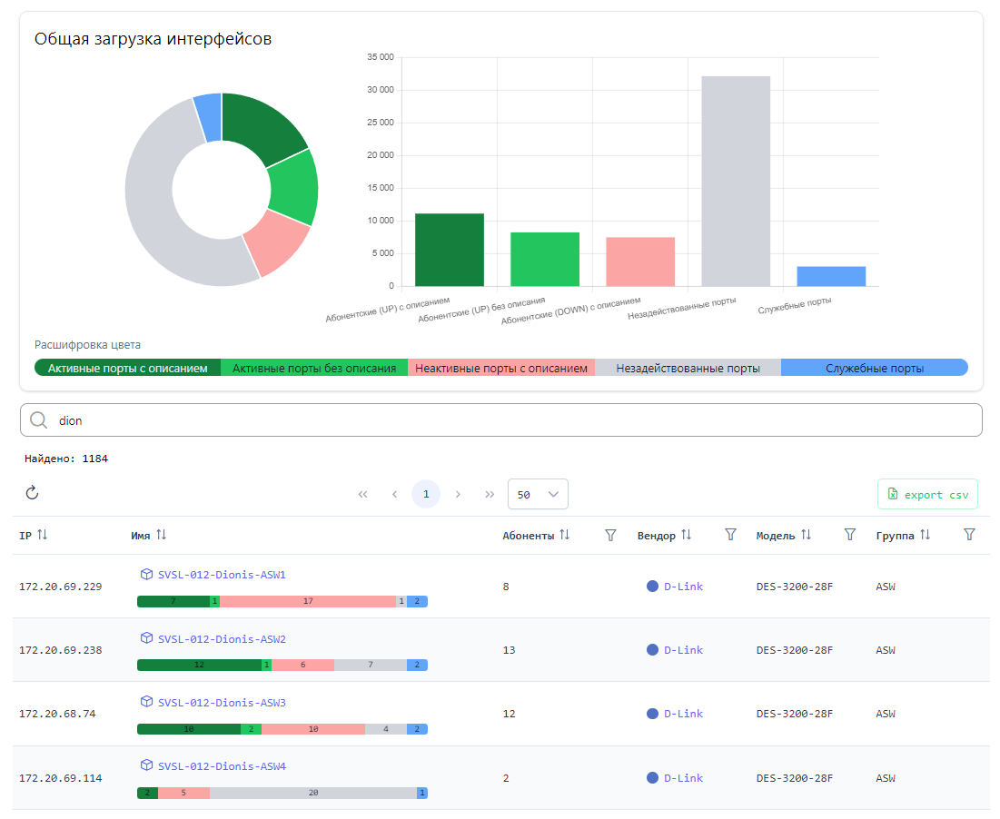
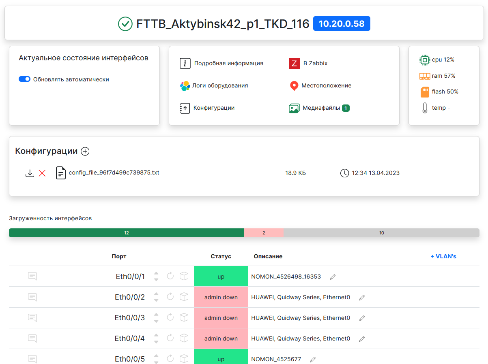

# Ecstasy


[](https://github.com/psf/black)

<div> 


</div>

### Веб-приложение для взаимодействия с сетевым оборудованием

Позволяет отображать информацию о сетевых устройствах в удобном для чтения формате
без ввода консольных команд.


### Структура


### Возможности:

- Взаимодействие с сетевым оборудованием
  - Отображение интерфейсов оборудования в реальном времени
  - Управление состоянием порта (up/down)
  - Просмотр MAC адресов на порту
  - Просмотр текущей конфигурации порта
  - Перенаправление для просмотра логов в Elastic Stack
  - Просмотр ошибок на порту
  - Возможность просматривать и сбрасывать текущую сессию по MAC адресу
  - Сохранение файлов конфигураций оборудования

Кроме того, Ecstasy предоставляет дополнительные функции для визуализации 
и поиска сетевой информации:

- Отображение топологии VLAN / MAC
- Поиск по текстовому описанию интерфейсов
- Поиск IP/MAC адреса
- Создание и просмотр интерактивных карт

### Поддержка производителей оборудования:

Список поддерживаемых вендоров приведен ниже. Другие модели тоже могут быть совместимы, но я имею доступ только к этим устройствам.
- `Cisco`
  - Проверено для: `WS-C4500*` `WS-C35*0` `WS-C3750*` `ME-3*00X` `ME-4924` `ME-3400`
- `Eltex`
  - Проверено для: `MES3324*` `ESR-12VF` `LTP-4X(8X)-rev.*` `LTP-16N`
- `MikroTik`
  - Проверено для: `RouterOS v6.* (v7.*)`
- `Huawei`
  - Проверено для: `S2403TP` `S2326TP` `CX600-X8` `CE6865`
- `Huawei DSL (GPON)`
  - Проверено для: `MA5600T`
- `Iskratel DSL`
  - Проверено для: `MPC8560`
- `D-Link`
  - Проверено для: `DES-3200-*` `DES-3028` `DES-3526` `DGS-3420` `DGS-12**`
- `Extreme`
  - Проверено для: `X460-*` `X670-*`
- `ZTE`
  - Проверено для: `ZXR10 2928E` `2936-FI` `2952E`
- `Q-Tech`
  - Проверено для: `QSW-3450-*` `QSW-8200-*`

### Развертывание приложения (Ansible)


1. Устанавливаем ansible.
2. Копируем проект и переходим в папку `ansible`.
3. Прописываем в файле `inventory/hosts` IP адрес и порт для подключения сервера, на который будет установлена система.
4. В папке `roles` находятся файлы с параметрами настройки приложения:

- `ecstasy-main.yaml` содержит основные переменные проекта;

```yaml
# ------- DIRS --------
root_folder: "/home/ecstasy" # Директория проекта

# ------ PYTHON -------
python_version: 3.11

# -------- WEB --------
django_superuser_username: superusername
django_superuser_password: password

gunicorn_socket: 127.0.0.1:8000
device_connector_socket: 127.0.0.1:9999

celery_concurrent: 2
celery_worker_name: worker1

flower_address: 0.0.0.0
flower_port: 5555
flower_username: monitoring
flower_password: flower-password

nginx_http_listen_port: 80
enable_https: no
# При включении HTTPS будет создан самоподписанный сертификат

# ------- REDIS --------
redis_broker_db: 0
redis_cache_db: 1
redis_password: redis-password
```

- `ecstasy-mariadb.yaml` - параметры для базы данных;

```yaml
mysql_root_password: root-password

# Пользователь будет создан
mariadb_user: ecstasy
mariadb_password: ecstasy-password
# База будет создана
mariadb_database: ecstasy

```

- `ecstasy-services.yaml` - для работы сервисов.

```yaml
# Названия сервисов
ECSTASY_SERVICE_NAME: ecstasy
CELERY_SERVICE_NAME: ecstasy-celery
DEVICE_CONNECTOR_SERVICE_NAME: ecstasy-device-connector
FLOWER_SERVICE_NAME: ecstasy-flower

# Переменные окружения для сервисов Ecstasy.
ALLOWED_HOSTS: "*"
DJANGO_DEBUG: 0
CONFIG_STORAGE_DIR: # директория в которую будут сохраняться файлы конфигураций 
DJANGO_SECRET_KEY:
CONTACT_NAME: # имя для обратной связи
CONTACT_EMAIL: # почта обратной связи
CACHE_KEY_PREFIX: ecstasy_prod
DEVICE_CONNECTOR_TOKEN: # токен для защиты device connector
DEVICE_CONNECTOR_DEFAULT_POOL_SIZE: 2 # кол-во сессий по умолчанию для одного сетевого оборудования
```

Необходимо указать недостающие и/или поменять параметры по умолчанию.

5. Далее запускаем ansible:

```shell
ansible-playbook -K -i inventory/hosts playbooks/deploy-ecstasy.yaml
```

6. Вводим пароль суперпользователя и ожидаем завершение установки.

### Удобный поиск оборудования


### Просмотр загруженности интерфейсов оборудований



При выборе оборудования показывается его информация:

- Состояние оборудования
- Нагрузка CPU, RAM, Flash и температура
- Подробная информация (берется из Zabbix)
- Ссылка в Zabbix
- Ссылка на карту с местоположением оборудования
- Логи в Elastic Search
- Перечень конфигураций
- Медиафайлы
- Интерфейсы





При выборе конкретного порта открывается его информация:
Описание, конфигурация, счетчик ошибок, диагностика состояния кабеля, список VAC адресов


Для станционных терминалов GPON OLT возможен следующий вывод информации об интерфейсе (указан ниже)


## Карты

Реализована возможность отображать и создавать интерактивные карты:

- Из ссылки на внешнюю карту;
- Из HTML файла карты;
- Из совокупности различных слоев. Слой может быть представлен:
  - Из группы в Zabbix (будут отображаться узлы сети, которые имеют координаты);
  - Из файла формата GEOJSON.

Интерактивные карты со слоями из Zabbix группы отображают доступность оборудования 
с описанием проблемы в Zabbix.


## Топология VLAN

Построение топологии VLAN по оборудованию.


## Топология прохождения MAC адреса

Определение маршрута MAC адреса между оборудованиями.


## Поиск по описанию порта


### Поиск IP или MAC адреса


## Создание связей моделей

```shell
python manage.py graph_models -a --rankdir LR --dot -g -o ./docs/models.dot
dot -Tsvg ./docs/models.dot -o ./docs/models.svg
```
