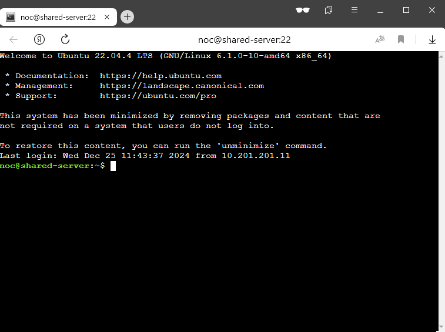
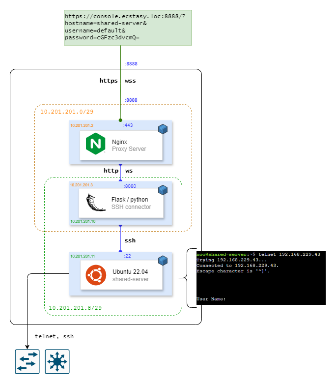
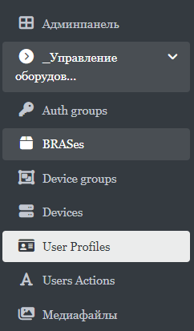
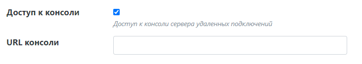

# Web-SSH

Веб консоль позволит подключаться по SSH ко временному серверу через браузер.
Далее вы сможете использовать telnet, ssh и прочие инструменты сразу для подключения
или диагностики оборудования.





## Запуск

Нужно создать файл `.env`, в котором будут указаны переменные.
Пример находится в файле `.env.example`.

Далее запускаете через:

```shell
docker compose build
docker compose up -d
```

## Настройка подключений

Чтобы зайти на сервер в браузере необходимо перейти по ссылке:

`http://<ip>:8888/?hostname=shared-server&username=default&password=cGFzc3dvcmQ=`

- hostname это IP или домен сервера. Так как запуск через контейнеры, то имя `shared-server`
  это название сервиса сервера ubuntu.
- username это имя пользователя, по умолчанию создан `default`.
- password это base64 закодированный пароль, который нужно указать в `.env` файле
  перед созданием образа контейнера. Если поменяли, то нужно пересоздать - `docker compose build`

## Интеграция с Ecstasy

Перейдите в панель администратора Ecstasy в раздел "Управление оборудованием -> User Profiles".



Выберите чей-то профиль и укажите полный URL для доступа к консоли.



Теперь перезагрузите страницу и увидите в меню "Консоль".

